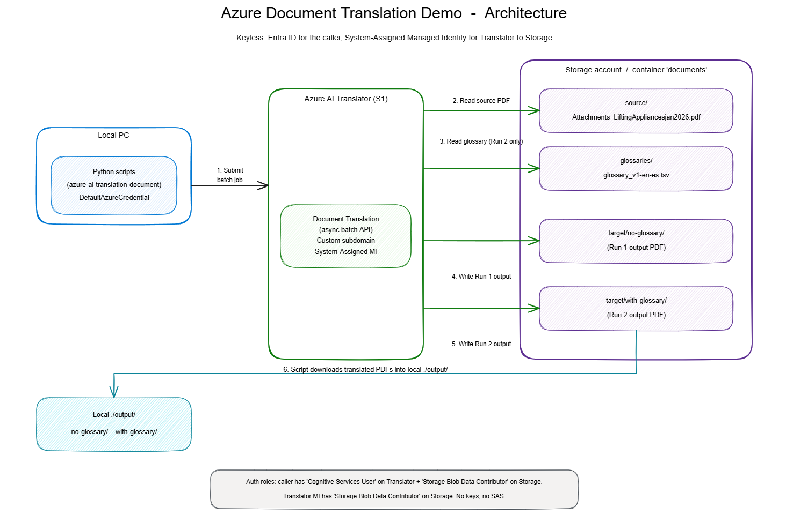

# Azure Document Translation — Glossary Demo

Translate an English PDF to Spanish twice using **Azure AI Translator → Document Translation (async batch)**:

1. **Run 1 — no glossary**: baseline machine translation.
2. **Run 2 — with glossary**: a domain TSV glossary steers specific terms.

Open both translated PDFs side-by-side to show how the glossary changes specific terminology (e.g., `rigging → aparejo`, `shackles → grilletes`, `working load limit → límite de carga de trabajo`).

Authentication is **fully keyless** via Entra ID and managed identity — no API keys or SAS tokens.

## Architecture



> Source diagram: open `docs/architecture.excalidraw` in <https://aka.ms/excalidraw> to view/edit.

- **Caller** (your laptop): `DefaultAzureCredential` (Az CLI login) → Translator data plane (`Cognitive Services User` role) and Storage data plane (`Storage Blob Data Contributor`).
- **Translator service** → Storage via its system-assigned managed identity (`Storage Blob Data Contributor`).
- Single blob container `documents` with virtual subfolders: `source/`, `glossaries/`, `target/no-glossary/`, `target/with-glossary/`.

## Repo layout

```
translatedemo/
  source_docs/osha_excerpt.pdf
  glossary/glossary_v1-en-es.tsv
  infra/
    main.bicep
    main.bicepparam
  scripts/
    common.py
    00_upload_inputs.py
    01_translate_no_glossary.py
    02_translate_with_glossary.py
    run_demo.py
  docs/architecture.excalidraw
  .env.example
  requirements.txt
```

## Prerequisites

- Azure subscription with permission to create resource groups, Cognitive Services accounts, storage accounts, and role assignments (Owner or User Access Administrator on the target RG).
- [Azure CLI](https://learn.microsoft.com/cli/azure/install-azure-cli) ≥ 2.60 (with `bicep` installed: `az bicep install`).
- Python 3.10+.
- The source PDF and glossary TSV (already in `source_docs/` and `glossary/`).

## 1. Deploy Azure resources (Bicep)

Region `eastus`, RG `rg-translatedemo` — these are Max's demo defaults. Customers should change them.

```powershell
az login
az account set --subscription "<your-subscription>"

az group create --name rg-translatedemo --location eastus

az deployment group create `
  --resource-group rg-translatedemo `
  --template-file infra/main.bicep `
  --parameters infra/main.bicepparam `
  --parameters deployerObjectId=$(az ad signed-in-user show --query id -o tsv)
```

This deploys:

- Azure AI Translator account, `kind=TextTranslation`, `S1`, custom subdomain, system-assigned managed identity.
- Storage account + `documents` blob container.
- Role assignments:
  - Translator MI → **Storage Blob Data Contributor** on the storage account.
  - You (deployer) → **Cognitive Services User** on the Translator account.
  - You (deployer) → **Storage Blob Data Contributor** on the storage account.

Capture outputs:

```powershell
az deployment group show -g rg-translatedemo -n main --query properties.outputs
```

## 2. Configure `.env`

```powershell
Copy-Item .env.example .env
notepad .env
```

Fill in from the deployment outputs:

- `TRANSLATOR_ENDPOINT` → `translatorEndpoint` (e.g. `https://cog-xltdemo-xxxxxx.cognitiveservices.azure.com/`)
- `STORAGE_ACCOUNT_NAME` → `storageAccountName`

The rest of the variables can stay at their defaults.

## 3. Install Python dependencies

```powershell
python -m venv .venv
.\.venv\Scripts\Activate.ps1
pip install -r requirements.txt
```

## 4. Run the demo

### Upload inputs to blob storage

```powershell
python scripts/00_upload_inputs.py
```

### Run 1 — no glossary (baseline)

```powershell
python scripts/01_translate_no_glossary.py
```

Translated PDF lands in `output/no-glossary/`. Open it and walk the audience through a few terms — note how generic MT renders them literally or inconsistently.

### Show the glossary

Open `glossary/glossary_v1-en-es.tsv`. Call out the terms you're about to demonstrate, e.g.:

| English | Spanish (glossary) |
| --- | --- |
| `rigging` | `aparejo` |
| `shackles` | `grilletes` |
| `working load limit` | `límite de carga de trabajo` |
| `slings` | `eslingas` |
| `qualified rigger` | `aparejador calificado` |

### Run 2 — with glossary

```powershell
python scripts/02_translate_with_glossary.py
```

Translated PDF lands in `output/with-glossary/`. Open it side-by-side with Run 1 and compare the same paragraphs.

### Or run everything in one shot

```powershell
python scripts/run_demo.py
```

## Notes / gotchas

- **PDF requires the async batch API** — Document Translation's synchronous endpoint does not support PDF.
- **Custom subdomain is mandatory** for the Translator endpoint; the Bicep sets it automatically.
- **Glossary matching is case-sensitive** by default. The provided TSV intentionally includes both `lifting appliance` and `lifting appliances`.
- **A glossary is a strong hint, not a guarantee** — the engine still applies grammar/agreement, so output may diverge from the literal TSV target.
- **Re-running a translation**: the scripts auto-clean the target subfolder before each run to avoid name-collision failures.
- **First-run RBAC propagation**: role assignments can take ~1 minute to take effect. If the first script call returns 401/403, wait and retry.

## Cleanup

```powershell
az group delete --name rg-translatedemo --yes --no-wait
```

## Handoff notes for the customer

Everything is parameterized. To deploy in their own environment, the customer:

1. Picks their own resource group and region:

   ```powershell
   az group create -n <their-rg> -l <their-region>
   az deployment group create -g <their-rg> -f infra/main.bicep `
     -p infra/main.bicepparam `
     -p deployerObjectId=$(az ad signed-in-user show --query id -o tsv) `
     -p location=<their-region> -p baseName=<short-name>
   ```

2. Copies `.env.example` → `.env` and pastes their own deployment outputs.
3. (Optional, for production) Restrict public network access on the Translator and Storage accounts, place them behind a Private Endpoint, and use a VNet-injected runtime to call the API.
